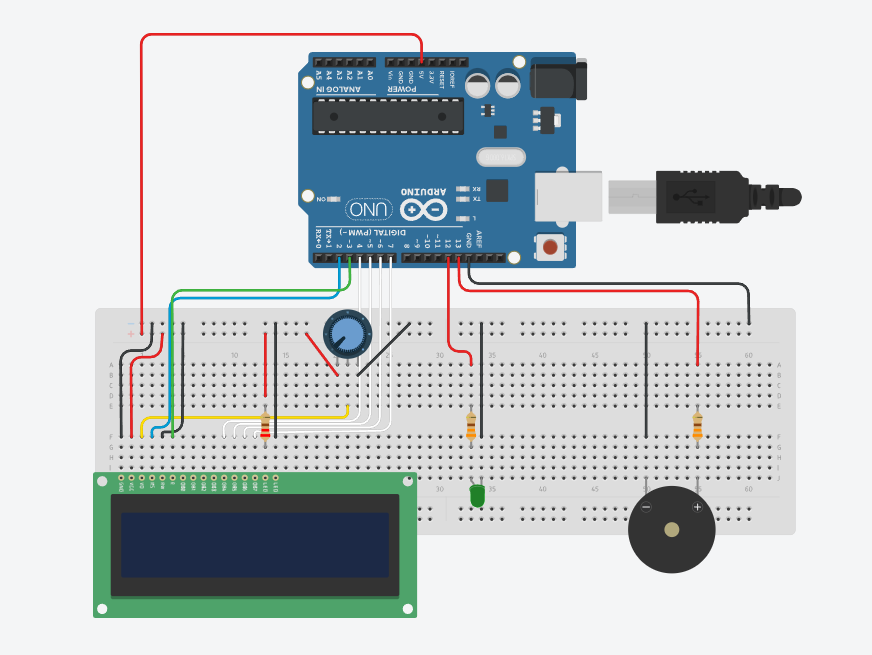

# Arduino Morse Translator

This Arduino circuit reads message from **serial** port and translates it into morse code while also transmitting the code. Additionaly, the result is being displayed on LCD screen.

## Used components

* **Arduino Uno R3** board
* **LCD-03335** display
* **LED-01447** diode (green)
* **EAK-00786** buzzer
* **Resistor 330 Om** (1/4W) *x2*
* **Resistor 220 Om** (1/4W)
* **Wire** (male-male) *x20*

## Connection

